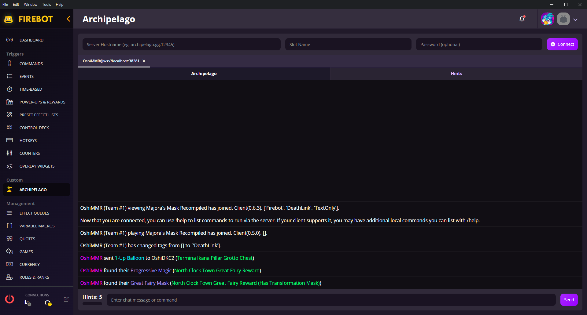
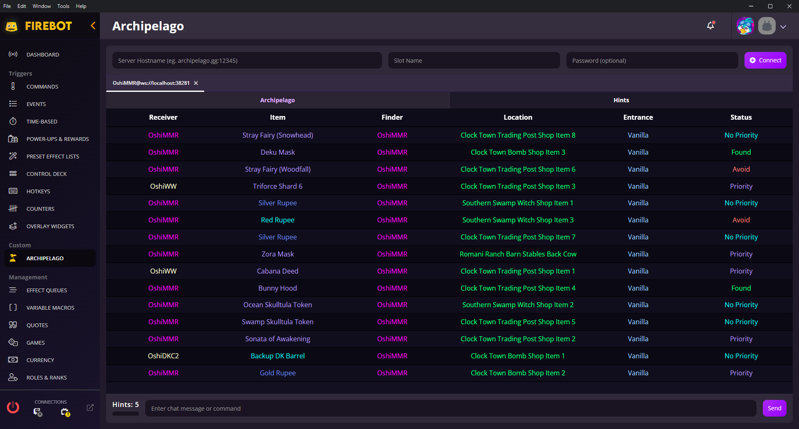

# Archipelago Client for Firebot

This script is an extension for [Firebot](https://firebot.app) that allows it to connect to Archipelago MultiWorlds and send and receive data as well as hook into various events.

### Setup

If you have a version of the script from before v1.0.0, be sure to remove the script by going to Tools > Plugin Manager or Settings > Plugins & Scripts and deleting the script, then use File > Open Data Folder and navigate to the scripts folder to delete the oceanityArchipelago folder

- In Firebot, go to Tools > Plugin Manager or Settings > Plugins & Scripts
  - Enable Plugins & Scripts if they are currently disabled
  - Click "Install From File"
  - Navigate to where you downloaded `oceanityArchipelago.js` and select that file
  - Confirm that you want to install the plugin
  - Click Save
- A new tab will be added to the main window of Firebot, "Archipelago"
  - Inside you will see a client with connection fields at the top
  - Insert credentials and click "Connect" or hit Enter
  - If successful, a new tab with the slot name and address should appear and begin to load events/messages from the client
